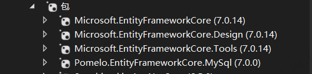

## 进阶语法使用说明

### 1，全局using

```c#
global  using System.Text.Json;
```

global 修饰可以将using引入到所有项目代码中，不再需要重复引入

### 2,	可为空类型

值类型不可为空，引用类型可为空（string）

### 3，record （语法糖）

- 编译器只会默认生成一个包含所有属性的构造方法，可确保所有属性都会被赋值
- 编译器最后生成的类中，自带Tostring以及 Equals 等方法，比较的是属性的值，而不是引用比较
- 所有属性默认**只读**
- 也可以部分属性只读（参数），部分属性可写（类中定义）
- 构造函数除了默认的之外，可以额外自定义构造函数（此构造调用默认构造，可灵活使用）
- with 关键词的使用，生成   仅仅只是改变几个需要的属性，其他属性不变的其他 record实例对象（见书23页）

 

### 4，异步

- 建议异步方法命名用 Async 结尾

- 异步方法如果没有 返回值  那么将返回值类型设置为 非泛型的 Tast

- 调用泛型方法 使用 await  如果不用这个关键词，那么就算是 异步方法也会同步执行

- 一个方法有await   那么此方法必须 用async 申明（传染性），这个声明只是用于在这个方法内用 await，只要返回值是Tast   或者Tast<T1>，就可以使用await   进行异步调用   

- 异步方法在执行时 遇到 await 后，当前线程不阻塞，会默认切换开辟一个工作线程 在这里阻塞等待 ，当前线程回退到主线程继续执行（不对不对，理解有误，应该是  **在对异步方法进行await 调用的等待期间，框架会把当前的线程返回给线程池，等异步方法调 用执行完毕后，框架会从线程池再取出一个线程，以执行后续的代 码。我们把这种由不同线程执行不同代码段的行为称作“线程切换”**）异步调用前的线程在异步等待期间 会被放回线程池，等异步等待结束之后，一个新的空闲线程会从线程 池中被获取，异步等待调用后续的代码会运行在这个新的空闲线程 中。

  特别注意：如果申明的

- 编译器把async拆分成多次方法调用，程序在运行的时候会 通过从线程池中取出空闲线程执行不同MoveNext调用的方式来避免线 程的“空等”，这样开发人员就可以像编写同步代码一样编写异步代 码，从而提升系统的并发处理能力。

- 异步的实现原理见书  28

- 一个申明为async的方法，如果方法内部没有await，那么在调用这个async方法时，就算是await调用，也是同步执行，没有线程切换

- 异步方法中暂停，不要使用Thread.Sleep,  这会阻塞调用的工作线程，用 **await Task.Delay(3000)**        延时3秒

- 异步方法提前终止，**见书40**

- Tast.WhenAll()     等待多个异步方法（子任务）都执行完毕，才向下执行，**见书40**

- Tast.WhenAny()    只要有一个异步方法（子任务）执行完就向下执行，**见书40**

**Tip：HTTPClientFactory  详细了解一下**


### 5，Linq

- **书41页  ，重点！！！！**


### 	ASP. NET Core中的依赖注入

#### 概念：：

框架自动创建对象的动作  就是  **注入**

前提是要先通过代码**预先**创建对象  **注册到 框架（容器）中**

这里的框架是什么意思？？？？？

负责提供   **对象的注册**  和  **获取功能** 的  **框架**   就是  **容器**

注册到容器中的对象   就是  **服务**

**容器负责服务的管理**

**注入服务**	就是在构造函数中用参数内部赋值


#### 行为，依赖注入框架在干什么？？

依赖注入框架根据  **服务类型**  获取  **实现类型**


#### 代码流程

先创建容器，在容器中注册服务

至于服务类型的这种类对象，自己定义，你懂的


代码关键词

后缀是Builder   的类    一般是   构建容器的类

Build() 方法 是创建容器


范围：Scoped                AddScoped    注册范围**服务**（对象）

瞬态：transient

单例：singleton       


#### **注意*

##### **不可以在  长周期对象中 引用  比它周期短的对象**

比如，单例中就不能引入  范围或者瞬态服务

why?    比如说 demo 类中依赖于 其他一些 服务，先将demo注册为单例，而他依赖的服务却是   范围，瞬态 的

那么，当依赖的服务消亡的时候，demo类是单例的，它还存在，却无法再正常工作，这就不行

而如果demo类注册时是 瞬态或者 范围的，那么当他的依赖服务消亡的时候，它也一同消亡，就不会有问题

总结就是，**外面的生存周期要比  里面的依赖服务  要短**

**注意，书中第三章的附带的源码 介绍 了 第三方NuGet包实现的依赖注入容器，可供参考学习复习**


### 寻找开发所需NuGet包

 点击进入   nuget.org   官网，根据相关英文名寻找

[NuGet 库 |家](https://www.nuget.org/)


## 配置系统的使用说明

有3种配置的操作

### 1，选项方式读取配置

建立  配置文件中对应的 mode类，

这个mode类    在写依赖注入的构造函数 代码处，**要 申明**  要注入对象的数据类型  **的时候**，不建议直接使用 这个mode类名

要使用泛型接口类型  如  (详情见书62)

```c#
IOptions<T>
IOptionsSnapshot<T>
IOptionsMonitor<T>
```

这样可帮助处理容器的生命周期，配置刷新等等**额外功能**

用于管理配置文件中的数据（见书62页）


### 2，环境变量中读取配置

**环境变量的配置**

电脑设置===》》》  关于   ====》》》 高级系统设置====》》》  环境变量

这个是运行时的环境变量 配置，一般用于 生产环境下  的软件初始化运行配置读取

（Windows 自带的环境变量 在此操作系统中全局共享 ）

VS也提供一种环境变量的配置，这个是用于方便开发时使用的 环境变量，这里只是方便于开发而已

VS的环境变量在 项目的属性  ===》》》调试====》》 环境变量

注意，重申一遍，真正的生产环境还得是 配置 Windows 自带的环境变量


### 3，命令行中读取变量


参考书，安装相关的包，

新建一个json 文件，用做配置文件


简单代码如书上描述

这里给出书上没有的，对照着书上代码

相关代码如图


## EF Core 连接使用MySql

[EF Core配置DbContext 连接Mysql数据库_ef 连接msyql-CSDN博客](https://blog.csdn.net/qq_61325957/article/details/130485321)


所需包



注意要输入两个命令，

**Add-Migration  自定义的迁移名（随便给）**  ：自动在项目的Migrations 文件夹下生成 相应的 C#代码

**Update-database** 	:  编译并执行 数据库的迁移代码

Migrations 文件夹下的C#代码文件名 就是  **Id+自定义的迁移名**


**一些概念：**

根据实体类生成 数据库表 的操作叫 “**迁移**” （模型驱动开发）

先创建数据库表后创建实体类  （数据驱动开发） WPF


## ASP.NET Core 框架说明

### 文件说明

wwwroot   是存放静态文件的文件夹

基础代码放在 Program.cs  项目代码入口中


### **控制器类**  

MVC中一般直接或间接继承Controller 类，

WebAPI中一般直接继承ControllerBase

至于Controller与ControllerBase的说明 见  书160

**控制器类**名字一般以Controller结尾

**控制器**名字 就是  **控制器类**的名字去掉 Controller

控制器类要用  [ApiController] 标注这是控制器


### 路由是什么？？

用于确定一个URL 请求  它到底在哪里执行处理（哪个控制器？）

代码中的[Route("")]  特性标签就是路由

而 [HttpGet]这种**谓词**，就是**用于确定**   是这个控制器中的**哪一个操作方法**


### 操作方法的相关说明

#### 返回值

**注意**，操作方法返回的对象  会被  ASP.Net Core 底层框架   **默认自动进行**  **JSON序列化** 的响应报文  返回给客户端，

操作方法的返回类型一般是  ActionResult<T> 

具体作用：   1，具体值 （类对象）到 ActionResult<T> 的隐式转换

​					2，特定方法  返回的 ActionResult 到ActionResult<T> 的转换

​				详情见书  172

#### 参数

从URL路径，报文体，QueryString  3种方式获取参数值, 这3中方式的微小的区别

##### 路径

见书173

可以在[HttpGet]  等attribute  中使用 占位符 （比如 { }）来捕捉路径中的参数内容

如果  捕捉的占位符与参数 **同名**，则不需要加  **[FromRoute]** 这个特性标签来找（类似路由效果）


##### QueryString

当URL中出现较长的混合逻辑，比如（书174）

那么  用  **[FromQuery]** 提取逻辑中的参数


##### 报文体

请求报文体的内容要与 参数申明的 类对象数据内容一致（书175）


### 缓存

#### 客户端响应缓存

见书200，很简单，加一个标签就可以了

#### 服务器响应缓存

不推荐使用

#### 内存缓存


### 过滤器（筛选器）Filter

同步的实现  IActionFilter

异步的实现  IAsyncActionFilter  接口


#### 异常过滤器

当系统出现未经处理的异常时，异常过滤器就会执行，就可以在异常过滤器中   对异常进行自定义处理


#### 操作过滤器

在操作方法的执行前后 ，增加一些自定义逻辑执行

书中的提供的   

1，自启用事务的 操作过滤器（事务回滚机制）,

2，请求限流器，用于终止恶意请求（终止操作方法的执行）


### Authtication  与  Authorization 高级组件

#### 标识框架


#### JWT

在ASP.NET Core中，JWT（JSON Web Token）的运行逻辑流程涉及到生成、发送、验证和授权等步骤。以下是详细介绍：

1. 用户认证：用户通过提供他们的凭据，如用户名和密码，来进行身份认证。在ASP.NET Core中，可以使用内置的身份验证中间件或自定义身份验证逻辑进行用户认证。

2. 生成JWT：一旦用户通过身份认证，ASP.NET Core应用程序会为该用户生成一个JWT作为身份验证凭证。在生成JWT时，可以添加一些声明（claims）来描述用户的身份特征，例如用户名、角色、权限等信息。这些声明将被编码为JWT的载荷部分。

3. 签名JWT：生成JWT后，应用程序会使用一个密钥来对JWT进行签名。签名使用头部和载荷中的数据，确保JWT在传输过程中没有被篡改。

4. 发送JWT：应用程序将JWT发送给客户端（通常是作为HTTP响应的一部分），客户端可以将JWT保存在本地（如本地存储、Cookie或浏览器的Web存储）。

5. 客户端请求：随后，客户端在未来的请求中将JWT作为身份验证凭证附加到每个请求的请求头、URL查询参数或Cookie中。

6. 验证JWT：当客户端发送请求时，服务端（ASP.NET Core应用程序）接收到JWT，需要验证其真实性和完整性。验证过程涉及到对JWT的签名进行解密和验证，确保签名有效和内容未被篡改。

7. 身份提取：通过验证JWT的签名后，服务端会从JWT的载荷部分提取出用户的身份信息，例如用户名、角色等，并将其填充到当前用户的身份对象（如ClaimsPrincipal）中。

8. 授权访问：服务端可以使用这些用户身份信息进行授权访问控制，决定用户是否有权访问请求的资源。这通常涉及到检查用户的角色、权限或其他声明来进行验证和授权操作。

总结：ASP.NET Core中的JWT运行逻辑流程包括用户认证、JWT生成、签名、发送给客户端、客户端请求中携带JWT、验证JWT的真实性和完整性、提取用户身份信息，以及使用身份信息进行授权访问控制。这个流程允许应用程序在分布式环境中进行无状态的身份验证和授权。

当继续使用JWT进行身份验证和授权时，ASP.NET Core应用程序通常会遵循以下步骤：

1. 客户端请求：客户端向服务端发起请求时，将JWT作为身份认证凭证附加到请求中，通常通过请求头的"Authorization"字段发送。

2. JWT认证中间件：ASP.NET Core应用程序使用合适的中间件来处理JWT的验证和身份提取。JWT认证中间件会在请求管道中间的某个位置拦截请求，并进行JWT的验证和处理。

3. JWT验证：JWT认证中间件会验证每个请求中附带的JWT的真实性和完整性，包括验证签名、检查过期时间、验证发行人等。如果JWT验证失败，中间件通常会返回一个身份验证失败的响应。

4. 身份提取：当JWT验证成功后，中间件会从JWT的载荷部分解析出用户的身份信息，例如用户ID、用户名、角色等。这些身份信息会被保存在用户的Principal对象中。

5. 授权验证：一旦用户的身份信息被提取并保存在Principal对象中，ASP.NET Core应用程序可以使用授权中间件来立即进行授权验证。授权中间件会根据应用程序的授权规则和策略，决定用户是否有权访问请求的资源。

6. 访问控制：在授权中间件执行授权验证后，应用程序可以根据用户的身份和角色或其他声明，决定是否允许用户访问请求的资源。这可以通过自定义的授权策略、要求特定的角色或声明，或执行更细粒度的访问控制规则来实现。

7. 响应结果：根据授权验证的结果，应用程序会返回相应的结果，可以是请求的资源数据或者拒绝访问的状态码及错误信息。

总结：在使用JWT进行身份验证和授权的ASP.NET Core应用程序中，客户端在请求中携带JWT作为身份认证凭证。应用程序通过JWT认证中间件来验证JWT的真实性和完整性，提取用户的身份信息，并使用授权中间件进行授权验证和访问控制。这将帮助应用程序实现基于JWT的无状态身份验证和授权功能。


## ASP.Net Core 网站部署

### 1，Windows 自带的一次性虚拟机（ 关闭重启后，操作数据不保存）

首先，要先在windows 的  设置--》应用中--》找到


点击打开

如图


选择这两个之后，重启电脑即可


找到这个并打开，

那么接下来就可以为所欲为了


2，ASP.Net Core 程序发布时设置说明


1. Release  的包运行速度比 DeBug 的快
2. 目标框架可以自选即可
3. 部署模式这里 **独立**：不依赖SDK，而是直接在项目中加入相关的依赖库文件          **框架依赖**：依赖于操作系统上预先安装的SDK，但是自身的程序包比较小
4. 目标运行时：可自选程序需要运行的操作系统环境


**文件发布选项**

1. 生成单个文件： 将程序包中的文件尽可能的合成一个文件，减少文件个数
2. 裁剪未使用的代码：程序包中添加的库文件中有些未使用的代码 裁剪
3. 再发布之前删除所有现有文件：（这个建议勾选） 这个是在发布时删除之前上一次发布在这里的代码包，然后重新生成新的程序文件，新的程序包   （但是注意，如果你需要调用第三方的  库文件DLL，比如说C++编译的动态库文件，那么这里勾选之后会一起删除，就要注意重新添加第三方库）


2，微/ 服务器端口 


## DDD

### 1，聚合与聚合根

高内聚，低耦合：

类中每一个方法，每一个成员变量都有充分的使用

类与类之间，模块与模块之间 联系度低


聚合的说明：

每个聚合之内只有一个 实体类作为聚合根，所有对一个聚合的操作访问 都通过 聚合根进行，外部系统只能持有对聚合根的 引用

聚合根不仅仅只是实体，还是所在聚合的管理者，再次强调，一个聚合只能引用另外一个聚合的聚合根 

注意：聚合要尽可能的设计的小一些（单一原则，接口隔离原则）


聚合的设计准则：（聚合关系的判断）

1，看他是否是整体与部分的关系，是否存在相同的生命周期，如果是，那就是聚合内的关系

2，实体类能否与外部系统交互，如果能，那么该实体类就是该聚合的唯一聚合根（一个聚合之内可能会有多个实体类），借此可区分与其他聚合的关系


### 2，领域事件与集成事件

领域事件：（MediatR）在同一个微服务内 的聚合之间 的事件 传递，在同一个进程内进行，通过进程内的通信机制就可以完成

集成事件：(RabbitMQ)跨微服务 的 事件传递，要引入事件总线来实现事件的传递，一般是用 消息队列服务器(三方服务器)中 发布，订阅 模式来实现事件总线

一般使用消息中间件来作为事件总线，常用的消息中间件有 Redis,  RabbitMQ, Kafka, ActiveMQ


