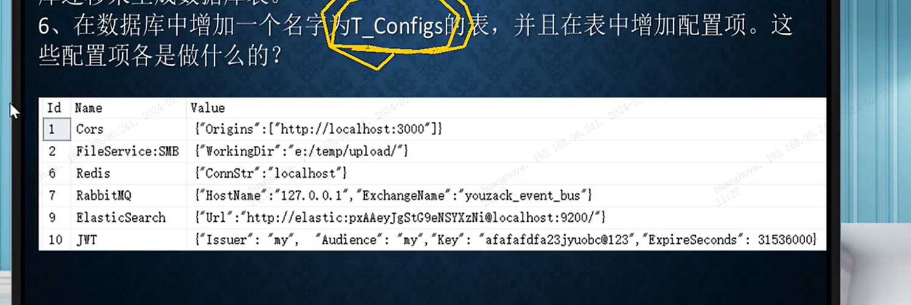

### 项目基本构思

初始化版本为 杨中科.英语学习网站

其中，ORM框架集成添加 sugarSQL，因为基于DDD，所以不用剔除 EFCore

数据库用 MySQL

关于代码分层

首先，DDD的核心不变，每一个服务就是一个独立的领域，

其次，将所用公共基础模块，以及公司BS框架中 公共层以及实体层分别也新建类库  ，一起放置在commons 的文件夹中

### 后端配置说明

### 项目基础说明

从客户端到 Nginx 服务器可以是 HTTP，也可以是HTTPS（推荐），两者的区别在于HTTPS可以防止流量的 截取，且数据加密

从Nginx到 后端微服务器集群 之间，HTTP与HTTPS 可自行选择

注意在 后端微服务器中的

### 项目可选用中间件，开源模块认知

- Zack.AnyDBConfigProvider  一个用数据库作为 配置服务器（从数据库读取配置的配置提供程序），在扬中科文件中附带代码
- .Net Core 没有内置的文本文件日志提供程序，使用第三方日志提供程序 Log4Net(大哥推荐), **NLog , Serilog**（博主推荐）
- 日志系统C#核心开发Nuget包  Microsoft.Extensions.Logging
- 集中式日志服务器，各台服务器都把 产生的日志 写入 日志服务器，像阿里云，Azure, AWS(亚马逊)这些云服务环境都提供了强大的**集中式日志系统**，如果不想依赖第三方云服务器，那么也可以使用 **自行托管的 集中式日志系统**，Exceptionless 和 ELK。  Exceptionless 是用C#开发的开源项目（搭建简单），ELK是目前开源流行的，用Java开发的。注意这两者也提供在线云服务功能（要付费），只是服务器都在国外，所以访问慢（把日志直接发给服务器），不推荐用他们的在线云服务功能，直接在本地部署 Exceptionless 或 ELK即可
- 区域服务注册自治  Zack.Commons
- StackExchange.Redis 连接Redis的NUGET包
- 

