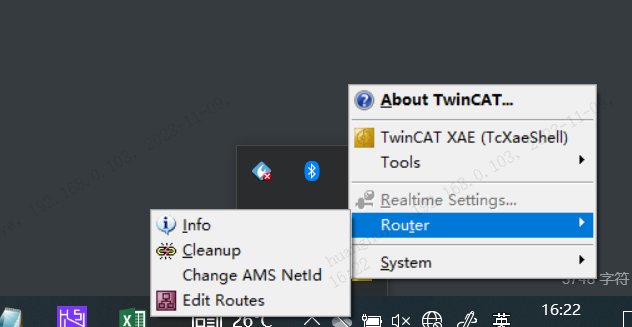
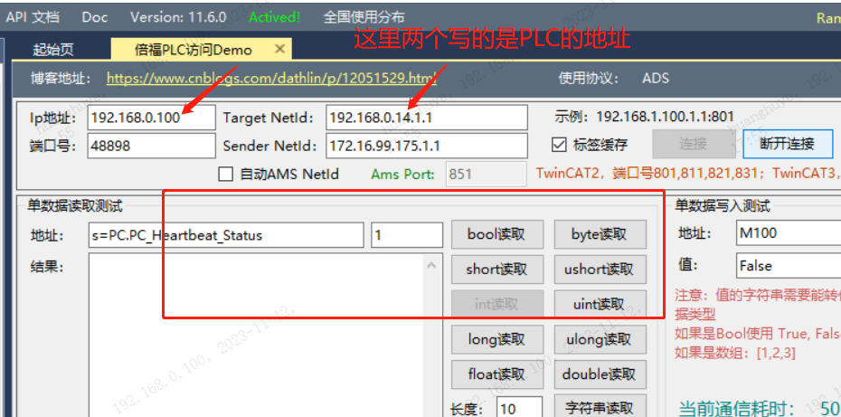
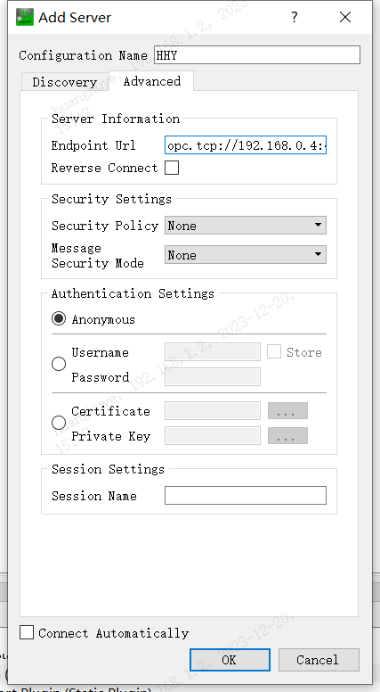
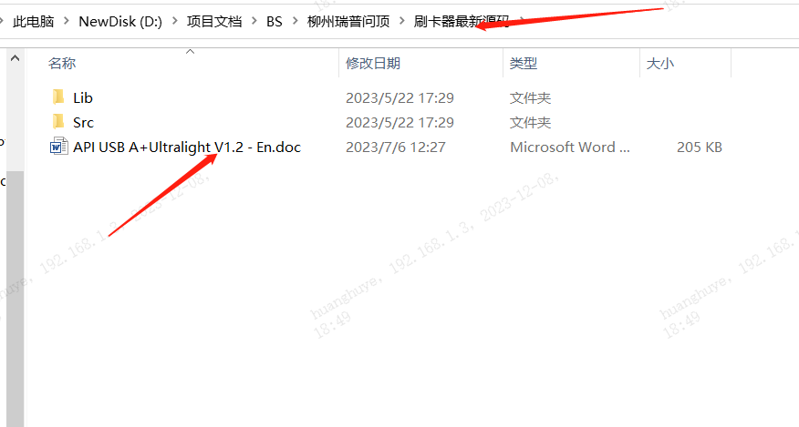

## 开机步骤

工控机
1，打开控制面板，关闭防火墙
2，右键此电脑，选择管理，点击本地用户组，设置密码1
3，CMD IPconfig，查看网络连接状态

4，组网，自己电脑连接设备工控机网卡WIFI地址
5，搜索Windows系统自带的远程桌面连接
6，搜索远程桌面 打开启动选项，搜索开发者模式打开启动选项

7，后台管理，参数配置，基础参数配置


机台密码：：

HMX28037766


管理员账户

chenguang

密码(一天一改)：

Hmx363


基本上大致的流程在PPT文档中有详细的说明，这里是一些容易疏忽的关键事项

- 远程连接时，要先确定确保工控机 是否已经开启 开发者模式，远程连接是否允许（搜索并点击启动）

- Dbeaver数据库客户端 安装时 一定要选择 all users ,不然如果只有管理员权限启动，那么其他权限登陆工控机使用时将会受到限制

  

## 基础认知

关于整个项目的部署逻辑

首先，PLC是什么？

PLC是一个可编程的嵌入式设备，它同样和上位机一样都是接入在局域网中通信，

PLC工程师   写代码利用PLC控制电气元器件（标准件），他们同样也需要将自己的程序导入PLC中用来控制  我们设备中的电子元器件，

在他们将PLC中的程序导入成功之后，我们的上位机需要显示相关数据，那么如何拿到数据？  

 他们PLC工程师会提供标签（PIC地址）给我们，也就是PLC地址表

而我们需要将PLC地址表中的数据配置成  我们代码中需要的 交互表（到了这里，你应该懂的），

那么在BS上位机部署成功  软件安装完毕之后，此时空跑运行没有数据显示，为了验证PLC与我们上位机的正确性，与PLC工程师对接

他们会在PLC中写入数据，

因为是在局域网中，我们的上位机可以获取同处于    同一局域网中的PLC中的数据，然后相关数据在前端显示，

以此验证双方是否正确一致


不管是 HSI   还是汇川的UA 软件，都是在同一局域网中连接 PLC（所以才会有IP地址），往里面读写数据，验证到底是PLC的问题还是我上位机的问题

具体的操作说明，稍后配图


HSI     欧母龙  CIP，改IP地址即可


关于交互表的导入说明

在软件前端，有一个导入交互表的功能，点击时发生了什么事情？？

1，前端获取交互表，并且展示一部分数据用于相关显示

2，前端发起HTTP请求到达后端，将一整份 交互表传至后端

​	（那么后端根据此交互表进行后续功能的逻辑处理）


### 快捷命令与基础操作

```
cd \Windows
cd ./System32
sc delete mysql


cd /d D:\上位机软件\mysql-8.0.28-winx64\bin
     cd /d D:\mysql-8.0.28-winx64\bin


install -psl.bat


mysql -uroot -p
mysql -uroot -p


source mysql.sql
```


**在当前文件中打开命令行**

**在当前目录按住shift再右键。 会看到右键菜单里有一个“在此处打开命令窗口”选项，点击即可。 也可以用快捷键操作：shift+右键 => 按W键 => 按Enter键**。


基础参数设置

设备名字，设备ID（参考  部署包里面   设备类型的Word文件）


汇川PLC软件的使用，注意IP地址的设备，端口是默认的不用改


拿到CT表之后，复制到交互表中

NG注意，建议新建一个记事本文件保存下来，然后一个个在前端后台管理中的  NG类别配置  一个个输入，注意提前与PLC人员确认  NG数据是否正确


### 自启动快捷方式

Windows+R  进入运行模式

输入

```shell 
shell:starup
```

进入电脑开机自启动下要执行的文件夹

将上位机启动脚本加入到这里

那么，每一次开机就会自启动这个脚本


**环境变量的配置**

电脑设置===》》》  关于   ====》》》 高级系统设置====》》》  环境变量

这个是运行时的环境变量 配置，一般用于 生产环境下  的软件初始化运行配置读取

VS也提供一种环境变量的配置，这个是用于方便开发时使用的 环境变量，这里只是方便于开发而已

注意，重申一遍，真正的生产环境还得是 配置 Windows 自带的环境变量


### 共享文件的访问

  

```
 输入 类似   \\192.168.150.37    的ip格式
```


### VPN使用


- 1.VPN用户名:24966
  密码:Mt@279#5f
  到期时间：2023-12-23
  2.在江门及江苏海目星办公区，不需要使用VPN。
  3.VPN使用说明：http://ssldesc.hymson.com.cn:8093/

  


## 激光刻码注意事项

### 1，鹏鼎激光脚本配置

脚本和图档文件如下


1，在安装鹏鼎软件的工控机中，点击图标为D的软件,

2，特别注意，这台工控机也要接入局域网，检查一下，查看这个IP地址

3，图档文件先导入到鹏鼎软件里，它会在左边出现4个左右的图标，如果左边都是空的，那么说明图档文件没有导进来，

​		需要手动设置，在左边的图标中，找到标签，类似QT的Qwige 的点击，再在空白处点击刻印

​		一共4个，如图


4，脚本放在同步线程01里面 

复制进来， 脚本里的IP修改IP地址为鹏鼎那台电脑的IP，先保存，再编译运行

5，用工具测试一下

打开自己电脑接入局域网


 update_code1;111111111111111111111111;11111111111111;1111111111


6，注意，在上位机配置文件中，修改激光刻码的刻码通道配置

7，最后  注意  

在上位机后台 修改 激光的相关配置     参数配置-> 刻码参数配置      IP和端口配置进去

​		注意有一个刻码的标签，交互表里面其他标签加了前缀的，这里也要加   |var|Inovance-PLC.Application.PC.EngraveCode_PC[0]

参考老赵文档     [刻码教学.pdf](file:///D:/黄浒烨/参考文档/刻码教学.pdf)

一切就绪  可以用上位机去刻码了


### 2，海目星激光


## 倍福PLC调试配置

安装ADS，设置路由（见参考文档），用HSI读

ADS是什么？安装在哪里？这里的路由是什么？干什么用的？怎么设置？

是用自己的电脑接入局域网用HSI读数据吗？里面是怎么设置的？

那换一种说法呢

1，首先，要在工控机上面安装   连接倍福PLC   的   ADS路由软件，用于使得PLC与工控机连接

2，注意路由的设置地址是PLC的地址

3，将HSI安装在工控机上。只写目标地址的协议ID即可连接，端口在协议中已经废除，不用管

4，在代码的配置文件中修改PLC相关配置


注意交互表的配置，倍福的PLC与汇川不一样，倍福的PLC地址标签，在交互表里面不需要任何前缀，因为底层框架已经做了处理

但是在HSI读取数据的时候，要注意加上  **s=**  的前缀，

注意在使用HSI时，单个数据，长度为1 ，数组和字符串要指定数据长度


**那么，如果想用自己电脑跑本地代码呢？？**

也是和上面一样的设置

**那么原理是什么？？为啥要这么做？？**

倍福的PLC有两层通信验证，一个是基础的TCP，接入局域网，一个是它自己的 Netid 验证，就是那个  IPV4地址+  .1.1 

那么，在自己本地的电脑，也要设置路由

如下图




**Charge AMS Netid**  

​		虽然你本地电脑和PLC在同一个局域网之内，可以Ping 通，但是你想要连接PLC，那么就要进行第二次的Netid 验证

你只需设置这个Charge AMS Netid  即可，那么接下来就可以愉快通信了


**Edit Routes** 是设置  路由到 PLC的地址（填写的就是PLC的地址）


特别注意




## 汇川PLC工具初始化说明

 输入        opc.tcp://192.168.0.4:4840

这里是PLC 的IP地址




## IIS 部署流程

首先 Windows + R  输入  inetmgr

进入网站挂载主页，先**停止**，再点击  **游览** ，

进入前后端的部署文件夹，分别将最新的程序包替换上去，注意之前旧版本的备份

特别注意，后端的APPData  与 前端配置文件中的端口 配置

务必保证  前端配置文件中的端口与  后端的监听端口一致

注意要清除  历史缓存

程序替换完成之后，再启动 


## 指纹锁的调试

指纹锁在这里的应用，是一个完全由上位机主导控制的硬件外设

用于用户的权限登陆

其他硬件外设的功能的添加，也可大致参考以下逻辑

解决问题的方式思维，比问题本身更重要

### 1，确定光学指纹模块的硬件功能是否正常

首先，安装指纹模块的硬件驱动程序（这个很重要）

其次，光学指纹模块供应商 官方的 demo程序可用来  测试  指纹锁模块的功能

要想运行这个demo ，必须先安装.net framework 3.5 及以上版本的net环境

注意，.net framework 4.6以及.net framework最新的4.8版本安装虽然不再需要网络连接

但是会与  ASP.net Core 7.0 版本的SDK冲突（测试过）

（已经一个个都试过）

 **推荐安装.net framework 3.5版本SDK（已经放在部署包里面），**

注意，此版本的安装需要工控机连接到互联网，工控机没有一般没有接入外网的网卡，所以无法直接接网

解决方法是，手机USB共享网络给工控机


回到开始，安装完SDK后即可运行demo，点击初始化，点击open,  按指纹，看是否有指纹显示，

如果有，则OK，否则就是硬件本身就有问题


2   C#编写的驱动代码

参考开发手册，按照硬件支持的通信协议，发送指令码，触发硬件内部的逻辑，等待硬件的回应码，判断硬件当前状态


## 驱动刷卡器

华城天祥刷卡器 （郑妮马lower）

一个需要C#调用C++库中驱动API的硬件

那么在以后的开发中，也会遇到类似的操作

先找供应商要到  说明文档以及源码，尽可能的得到C# Demo



将C++库 添加到bin目录下供 主程序模块调用（注意看是否要添加环境变量，我没注意到，软件包是直接加的）

打开后端，Swagger ，找到刷卡的API， 点击execute，放入卡，不用动，2秒自动识别一次

一切正常那么就可以得到卡号

如果异常，请务必检查库文件是否加入，如果提示  硬件找不到 无法识别，则更换该刷卡器连接到工控机的USB口

相关PO代码，参考Git日志记录


