## Git使用流程


注意：：第6步是合并请求的意思，将你的分支代码合并到主分支上面


## 小乌龟使用说明：：

首先，不管是登陆进公司内网还是网上开源社区，在克隆的时候，会有一个地址，将这个地址拷贝下来，

一般来说，在鼠标右键进入本地的**Git克隆**选项的时候，这个地址会自动识别

如下图的  **URL**


这里的目录是存贮该项目的路径（可自行设置）


接下来自己创建一个分支（右键小乌龟，点击创建分支），给定名字和描述，并从当前分支切换到这个创建的分支

如图


在接下来，代码完成并测试好了以后，

右键点击提交到分支（你自己的分支）    ======》》》》   Git提交 （后面箭头指的是当前分支）

注意，这里的提交只是提交到本地的服务器


推送  是将当前服务器的分支项目 提交到 主分支

拉取  是将主分支上面的项目同步到当前服务器


## 公司代码拉取


审核通过之后，点击详情


得到证书与机械码

回到项目列表


查询得到 Git的URL


然后在一个新建的空文件夹中

注意一定是空文件夹里面

右键鼠标，选择小乌龟的新建版本库

如图


得到这个


然后在这里

右键小乌龟，选 拉取

进入这里


在这里选择要拉取的分支

指定Git的URL地址


然后拉取成功


**注意**：在VSCode 中的代码文件   上传到  GIT上维护，如果直接用Git命令在终端执行，太麻房了，

这就像在终端使用数据库一样，已经out了

所以这里个人建议不用终端命令的方式使用Git，推荐是小乌龟这种 图形化的客户端工具，VS这种IDE也已经集成了GIT功能

相当好用！！！（工具先会用就行，如果有相关的软件功能开发就再深入学）

但是终端命令也需要了解一二   

这里给出B站教程

1， [git、github 保姆级教程入门，工作和协作必备技术，github提交pr - pull request_哔哩哔哩_bilibili](https://www.bilibili.com/video/BV1s3411g7PS/?spm_id_from=333.999.0.0&vd_source=88a686d64491735d5cf61469abedb165)

2，[29_指令速查_git流程_哔哩哔哩_bilibili](https://www.bilibili.com/video/BV1MU4y1Y7h5?p=29&vd_source=88a686d64491735d5cf61469abedb165)

## 个人GIT仓库建立以及代码维护

### 1，GitHub 的使用

首先提供一个方法访问GitHub，都需要下载软件

[『教程』手把手教你流畅访问Github_哔哩哔哩_bilibili](https://www.bilibili.com/video/BV1Aq4y1q7hr/?spm_id_from=333.337.search-card.all.click&vd_source=88a686d64491735d5cf61469abedb165)

#### （1）访问 GitHub 建立代码仓库

参考资料

######  [github日常操作指南！教你简单好用的github_哔哩哔哩_bilibili](https://www.bilibili.com/video/BV1zs4y177sq/?spm_id_from=333.999.0.0&vd_source=88a686d64491735d5cf61469abedb165)

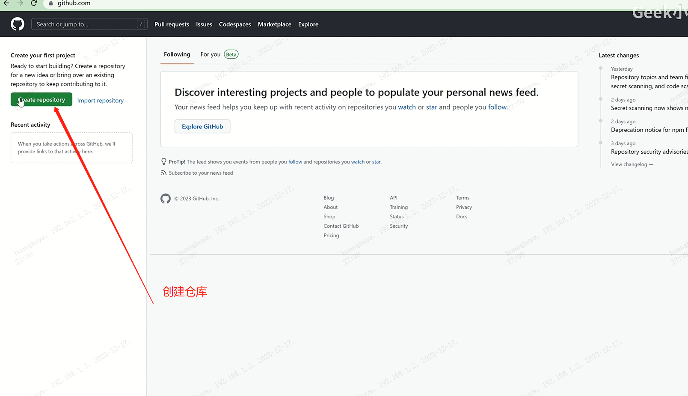

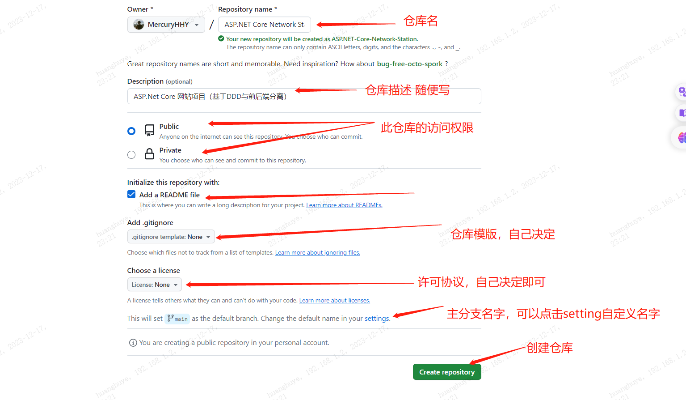

仓库建立好了之后，接下来要将项目代码上传到GitHub，继续

#### （2）用IDEE 集成功能 连接 个人的 GITHub 

##### VSCode 连接个人的 GITHub 

VSCode 中安装这个插件  如图

此扩展可允许 直接访问 GitHub 上的仓库

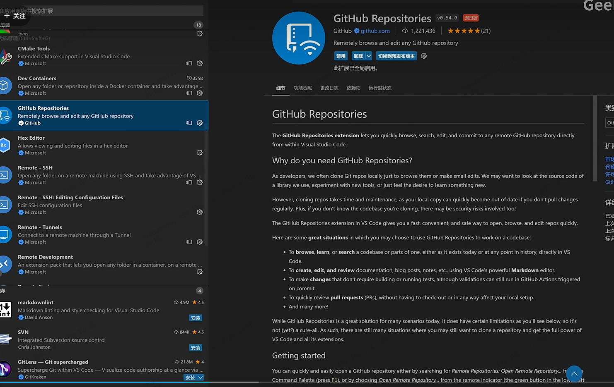

然后点击如图步骤

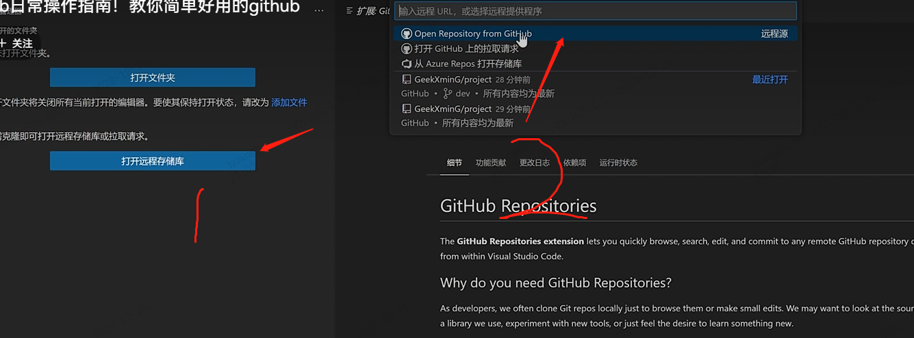

第一次会有一个登陆授权的页面，登陆即可

在这里继续选择 你GitHub 上的一个仓库

然后进入  如图示例

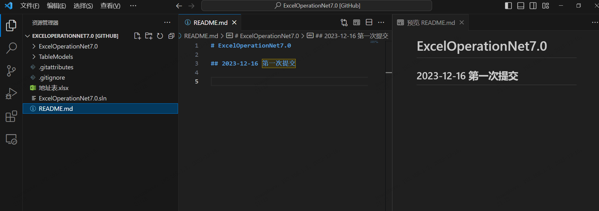

在这里 GURD 之后 ，这里都会该出修改的提示（要先保存，才会有提示）

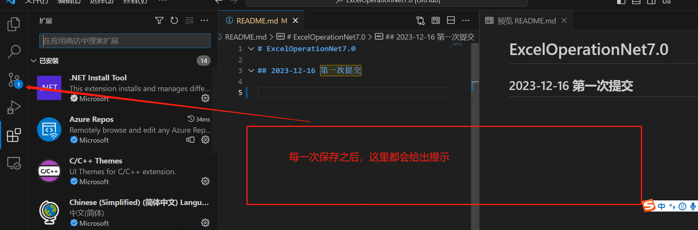


**注意上传提交** 要输入相应的 Git 消息

如提交   

```Git
1 commit
```

```
add a file
```

这个消息是 这个文件的说明,也就是 提交的分支日志（消息日志）

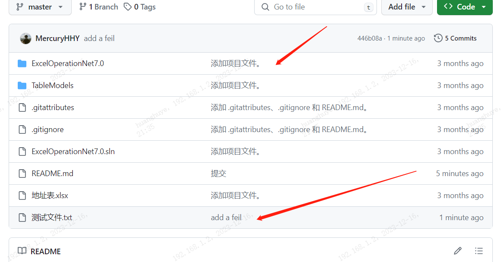


（3）在 GitHub  上面建立一个新的分支

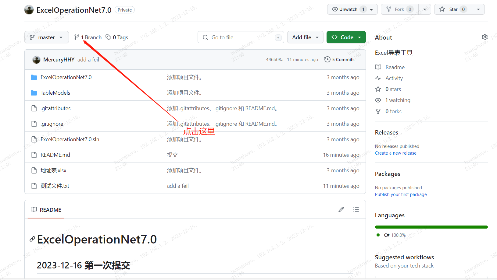

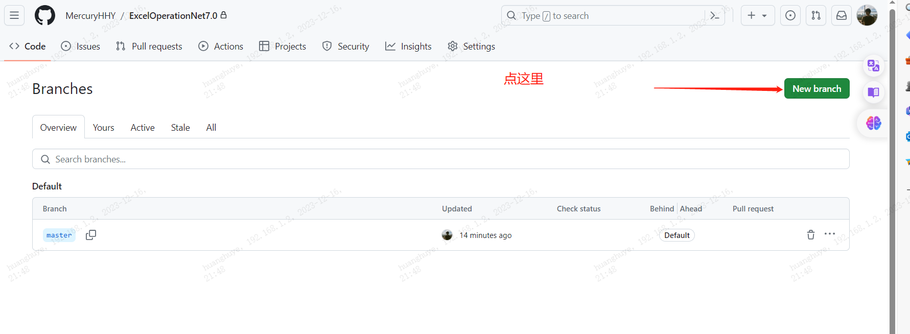


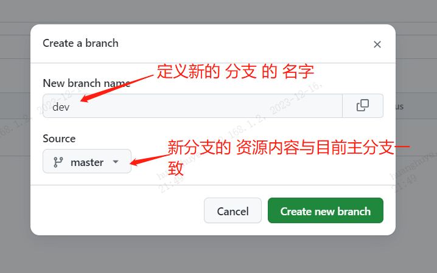

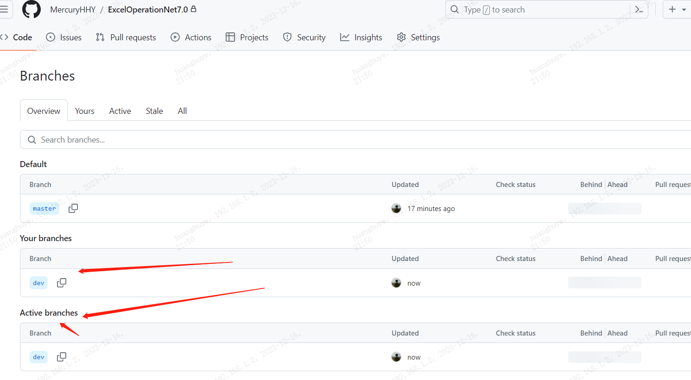

到这里说明分支建立成功

注意在分支提交了新的内容之后，会有提示要求你合并分支（如图）

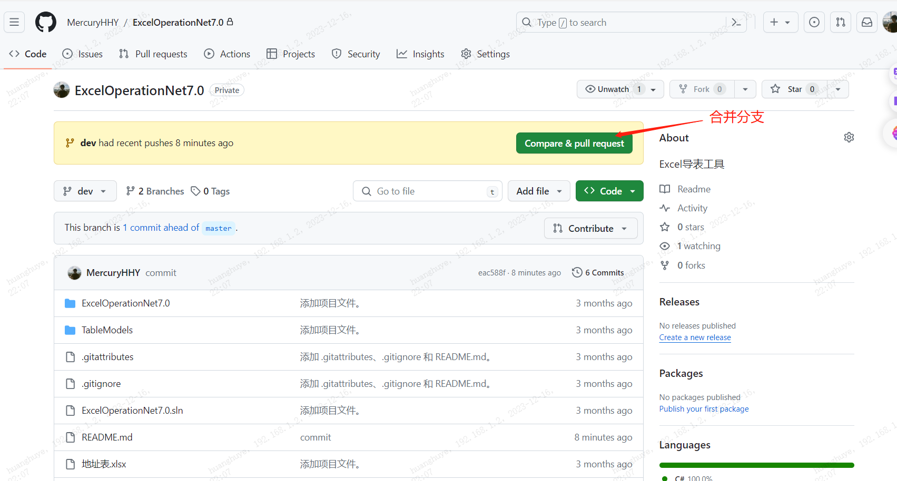


##### VS  连接个人的GitHub

注意 先提交 再推送

1，VS中也可以 快捷建立 仓库直接同步到GitHub,

只要在点击Git，选择推送到Git服务，选择相应的远端  即可

如图

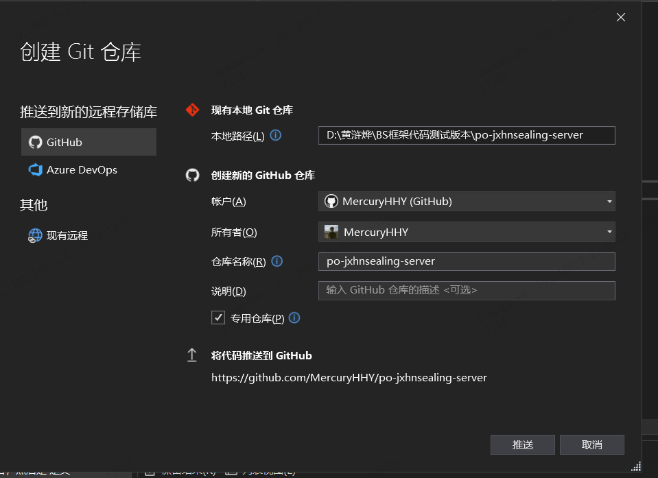


2，或者将已有代码上传到GitHUB     如图

点击现有远程，然后输入URL即可

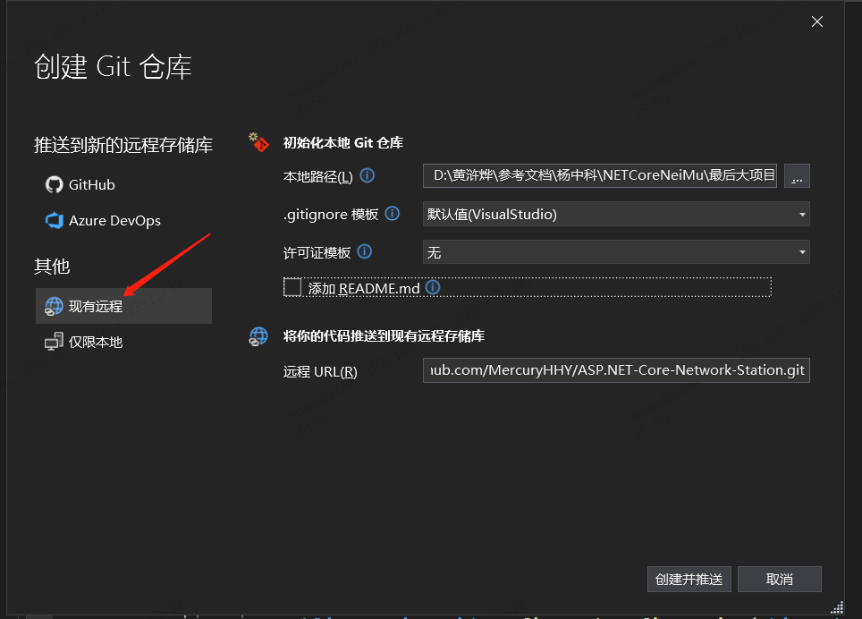


#### （3）合并分支

在VS中合并分支，很简单

### 2，Gitee 码云 的使用

小乌龟与Gitee 码云 的使用 请注意参考资料中的详细说明

**官方文档如下**

[Gitee 帮助中心 - Gitee.com](https://gitee.com/help)

### 3，公司内部的GitLab 的使用


