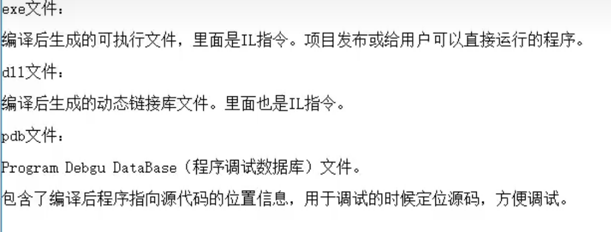
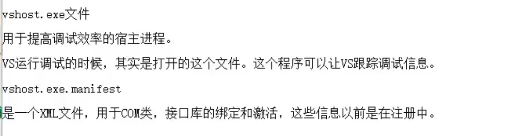

## 解决方案：：

是将该方案下的所有项目统一管理编译，可设置其中一个项目作为启动项目执行

## 在VS生成的项目文件说明

在bin/Debug/ 的路径下，一些主要文件的说明

还有一个config文件，主要用于保存工程配置的信息

### VS中的模版

对于VS中的每一个模版，他已经自动配置好了编译器的参数并准备好了一套基本的源码

你直接使用，无需配置即可利用模版生成你相应的编译结果（DLL库，图形界面等等）

你不好奇他具体怎么做的吗？？

其实也可以自己做一个模版，不是要你搞配置文件啊

你只需要导出项目模版即可，那么下一次的二开就非常快捷了

（项目-->>>导出项目模版------>>>>>自己看着来）

## VS使用说明

- 在 Windows 上，按住 Alt 键并使用鼠标左键拖动选择多个文本块。
- 断点右键可以选择设计条件断点，条件断点只有满足条件才能执行
- 单条语句执行时，可以鼠标拖动执行箭头到上方
- 断点可以随鼠标拖动
- 一个项目中想要直接引用另一个项目的源代码文件，选择添加里面的  《现有项》-----找到文件-《注意：：：是**添加链接**，在添加的下面去选》
- 

