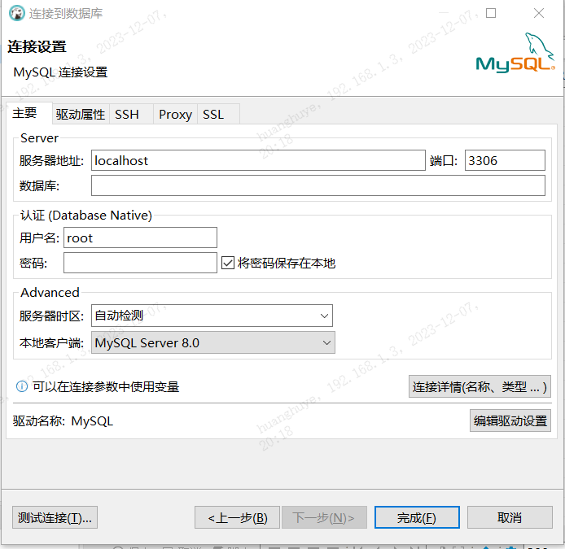

## DBserver  的使用以及注意事项

1，DBserver  连接远程数据库

在这里写入相应的

服务器地址（IP地址，远程数据库一般需要VPN才能连上，同一个局域网不需要VPN 你懂的），

数据库名（可以不写或者自定义）

用户名，密码 都要写，其他不用管，测试连接，完成即可

相关参考[图像化数据库工具DBeaver远程连接云服务器的MySQL数据库_dbeaver通过域名连接数据库_皓月盈江的博客-CSDN博客](https://blog.csdn.net/u013541325/article/details/132600720)

